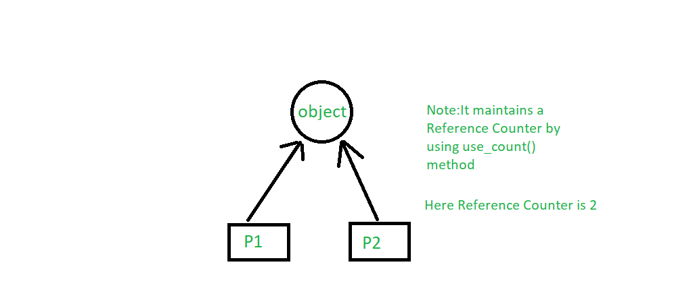

# C++ smart pointers
## What is a smart pointer
Smart pointers are to automate new-delete process.

With smart pointers, calling new does not require calling delete.

#### What happens when we create a smart pointer?
    1. it calls new and allocate memory
    2. the occupied memory will be freed at some point.

### Difference between pointers and smart pointers
Smart pointers are a wrapper around raw pointer.


## How to define smart pointers
#### How many different kinds of smart pointers are there


**std::unique_ptr** unique pointer 

- exclusive ownership: unique_ptr stores one pointer only. We cannot copy a uniaue pointer.

- no overhead

```
    std::unique_ptr<Type_Name>Ptr_Name = make_unique<Type_Name>()
```
**std::shared_ptr**

- shared ownership
- some overhead



#### How to use
1. get the header file
```
    #include <memory>
```

## When to use smart pointers
1. use unique pointers for <u>exclusive-ownership resource management</u>.


## To read
1. variable lifetime
2. heap memory